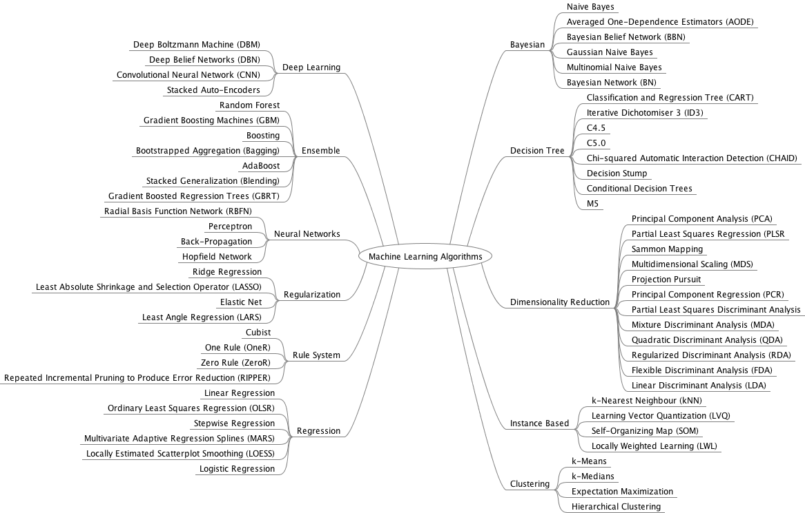

# Machine-learning-resources
---

**Here are some resources about machine learning I collected during learning.**

# 1. fundamental
- [google python styleguide](https://github.com/zh-google-styleguide/zh-google-styleguide/tree/master/google-python-styleguide)

# 2. overall
- [UC Berkeley CS188 Intro to AI -- Course Materials](http://ai.berkeley.edu/lecture_videos.html)
- [Tutorial Slides by Andrew Moore](https://www.autonlab.org/tutorials)([detailed](https://www.autonlab.org/tutorials/index.html))
- [sklearn ML algorithm cheat-sheet](http://scikit-learn.org/stable/tutorial/machine_learning_map/index.html)
- [A Tour of Machine Learning Algorithms](https://machinelearningmastery.com/a-tour-of-machine-learning-algorithms/) by Jason Brownlee
- [Stanford CS229: Machine Learning](http://cs229.stanford.edu/)
- [Understanding the bias-Variance Tradeoff](http://scott.fortmann-roe.com/docs/BiasVariance.html)

# 3. supervised learning
- **feature selection** [1](https://machinelearningmastery.com/an-introduction-to-feature-selection/) [2](https://machinelearningmastery.com/feature-selection-machine-learning-python/) [3](https://machinelearningmastery.com/feature-selection-in-python-with-scikit-learn/) by Jason Brownlee
- [**Random Search** for Hyper-Parameter Optimization](http://jmlr.csail.mit.edu/papers/volume13/bergstra12a/bergstra12a.pdf)
- [**xgboost**](https://www.analyticsvidhya.com/blog/2016/03/complete-guide-parameter-tuning-xgboost-with-codes-python/)
- [Visualizing **Gradient Boosting**](http://arogozhnikov.github.io/2016/06/24/gradient_boosting_explained.html)
- [数学之美番外篇：平凡而又神奇的贝叶斯方法](http://mindhacks.cn/2008/09/21/the-magical-bayesian-method/) by 刘未鹏
- [SVM原理及解释](https://www.cnblogs.com/xiaomacgrady/p/5136379.html)/[Lagrange Multiplier and KKT](http://www.cnblogs.com/zhangchaoyang/articles/2726873.html#mjx-eqn-secondhalf)
- [**t-SNE** (t-Distributed Stochastic Neighbor Embedding)](http://lvdmaaten.github.io/tsne/)

# 4. unsupervised learning
- [Visualizing **K-Means Clustering**](https://www.naftaliharris.com/blog/visualizing-k-means-clustering/)
- [Clustering Silhouette Coefficient](http://scikit-learn.org/stable/modules/clustering.html#silhouette-coefficient)
- [PCA](http://wiki.mbalib.com/wiki/%E4%B8%BB%E6%88%90%E5%88%86%E5%88%86%E6%9E%90%E6%B3%95)
- [Visualizing **PCA**](http://setosa.io/ev/principal-component-analysis/)
- [Dissecting **Reinforcement**](https://mpatacchiola.github.io/blog/2016/12/09/dissecting-reinforcement-learning.html)
- [UCL Course on **RL**](http://www0.cs.ucl.ac.uk/staff/d.silver/web/Teaching.html)
- [**RL**: An Introduction](http://ufal.mff.cuni.cz/~straka/courses/npfl114/2016/sutton-bookdraft2016sep.pdf)

# 5. deep learning
- [tensorflow playground](http://playground.tensorflow.org)
- [DL of class central](https://www.class-central.com/report/deep-learning-online-courses/)
- [The neural network zoo](http://www.asimovinstitute.org/neural-network-zoo/)
- [Machine Learning Notebook(DL)](https://mlnotebook.github.io/)
- [tensorfly](http://www.tensorfly.cn/home/)
- [Understanding LSTM Networks](http://colah.github.io/posts/2015-08-Understanding-LSTMs/) by Christopher Olah
- [An Intuitive Explanation of **C**onvolutional **N**eural **N**etworks](https://ujjwalkarn.me/2016/08/11/intuitive-explanation-convnets/)
- [**Dropout**: A Simple Way to Prevent Neural Networks from Overfitting](http://jmlr.org/papers/v15/srivastava14a.html)
- [**optimization**](http://ruder.io/optimizing-gradient-descent/index.html)

### 5.1 book
- [MIT deep learning book](http://www.deeplearningbook.org/)
- [Neural Networks and Deep Learning](http://neuralnetworksanddeeplearning.com/) by Michael Nielsen 

### 5.2 Schedule and Syllabus
- [National Taiwan Univ](https://www.csie.ntu.edu.tw/~yvchen/f106-adl/syllabus.html)
- [Stanford CS20: Tensorflow for Deep Learning Research](https://web.stanford.edu/class/cs20si/syllabus.html)
- [Stanford CS231n: Convolutional Neural Networks for Visual Recognition](http://cs231n.stanford.edu/)

### 5.3 play
- [MIT deeptraffic](https://selfdrivingcars.mit.edu/deeptraffic/)
